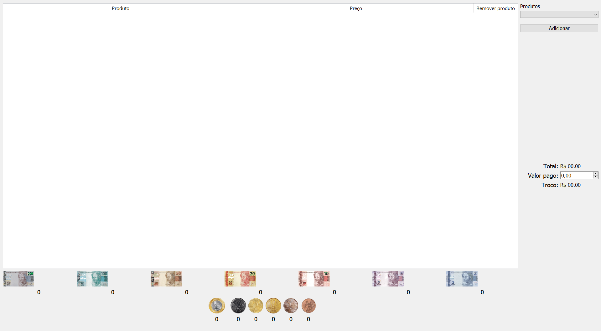
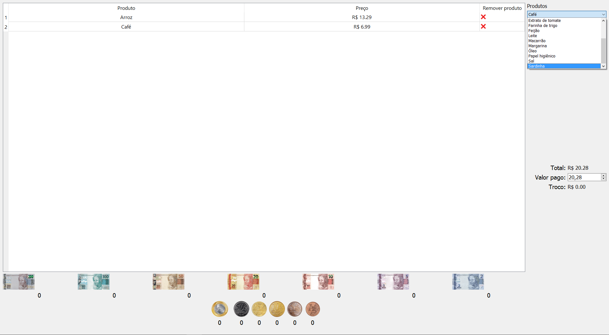
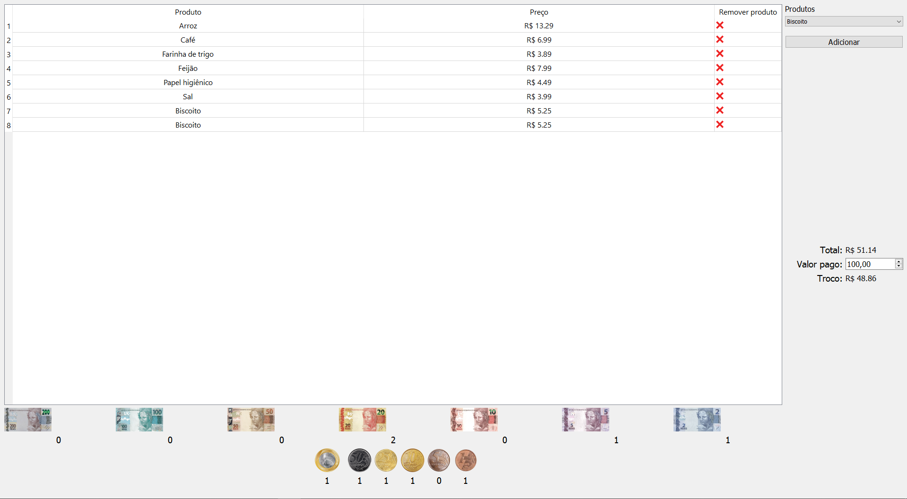

# NomedoProjeto

**Número da Lista**: 3 
**Conteúdo da Disciplina**: Greed 

## Alunos
|Matrícula | Aluno |
| -- | -- |
| 16/0133505  |  Lucas Gomes Silva |
| 19/0134623  |  Marcos Diego da Silva Gomes |

## Sobre 
O projeto tem como objetivo utilizar o conceito de algoritmos gulosos (greedy algorithms) no ambiente de supermercados. Por meio de uma lista de produtos, que poderão ser escolhidos pelo cliente, é gerado o valor total da compra. Após a inserção do valor pago é mostrado na tela o resultado do troco da compra e a menor quantidade de cada cédula e/ou moeda que deverá ser utilizada no mesmo.

## Screenshots
#### Tela inicial

#### Lista de produtos

#### Valor total da compra juntamente com o troco e a quantidade de cada cédula e/ou moeda a ser utilizada

## Instalação 
**Linguagem**: xxxxxx 
**Framework**: (caso exista) 
Descreva os pré-requisitos para rodar o seu projeto e os comandos necessários.

## Uso 
Explique como usar seu projeto caso haja algum passo a passo após o comando de execução.

## Outros 
Quaisquer outras informações sobre seu projeto podem ser descritas abaixo.

